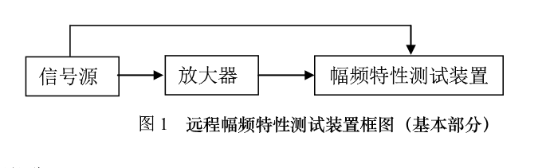
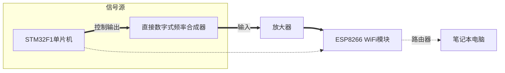
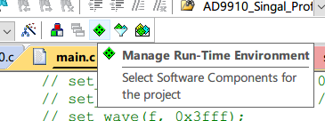
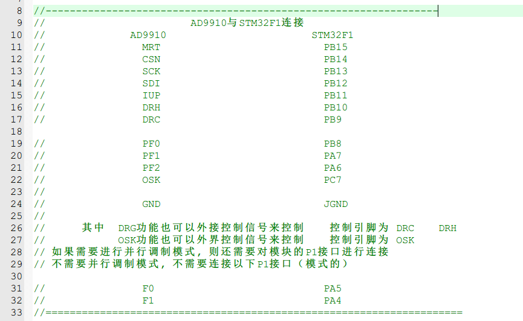
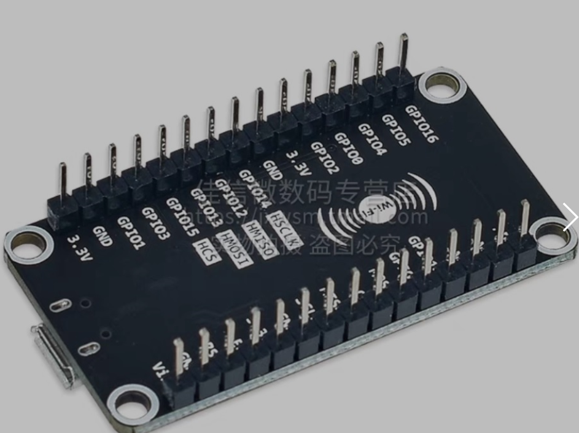
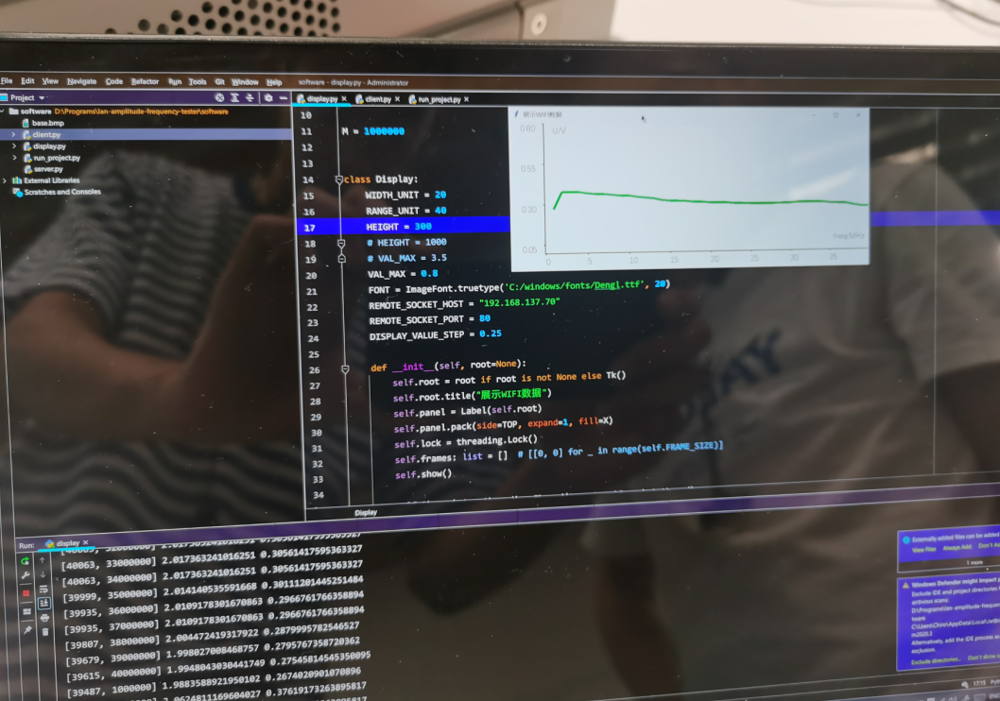
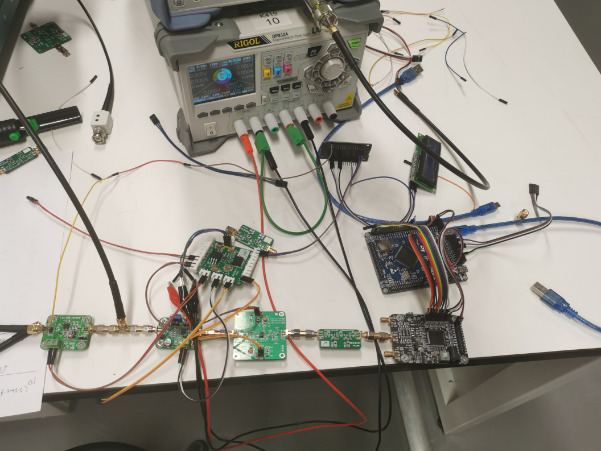

# WiFi 幅频测试仪

## 题目

电赛 2017年题目 **远程幅频特性测试装置（H题）**

【本科组】

#### 任务

设计并制作一远程幅频特性测试装置。

#### 要求

1．基本要求

（1）制作一信号源。输出频率范围：1MHz -  40MHz；步进：1MHz，且具有自动扫描功能；负载电阻为600时，输出电压峰峰值在5mV - 100mV之间可调。

（2）制作一放大器。要求输入阻抗：600；带宽：1MHz   - 40MHz；增益：40dB，要求在0 - 40 dB连续可调；负载电阻为600时，输出电压峰峰值为1V，且波形无明显失真。

（3）制作一用示波器  显示的幅频特性测试装置，该幅频特性定义为信号的幅度随频率变化的规律。在此基础上，如图1所示，利用导线将信号源、放大器、幅频特性测试装置等三部分联接起来，由幅频特性测试装置完成放大器输出信号的幅频特性测试，并在示波器上显示放大器输出信号的幅频特性。

图1   远程幅频特性测试装置框图（基本部分）

2．发挥部分

（1）在电源电压为+5V时，要求放大器在负载电阻为600时，输出电压有效值为1V，且波形无明显失真。幅频特性测试装置信号源放大器

（2）如图2所示，将信号源的频率信息、放大器的输出信号利用一条1.5m长的双绞线（一根为信号传输线，一根为地线）与幅频特性测试装置联接起来，由幅频特性测试装置完成放大器输出信号的幅频特性测试，并在示波器上显示放大器输出信号的幅频特性。

图2   有线信道幅频特性测试装置框图（发挥部分（2））

（3）如图3所示，使用WiFi路由器自主搭建局域网，将信号源的频率信息、放大器的输出信号信息与笔记本电脑联接起来，由笔记本电脑完成放大器输出信号的幅频特性测试，并以曲线方式显示放大器输出信号的幅频特性。

图3   WiFi信道幅频特性测试装置框图（发挥部分（3））

（4）其他。

#### 说明

1. 笔记本电脑和路由器自备（仅限本题）。
2. 在信号源、放大器的输出端预留测试端点。

## 结构说明

## 运行说明

1. STM32F1

   1. `\stm32\release`下打开$\mu Vision5$工程`cvbs.uvprojx`

   2. 使用这个包管理器更新依赖

      1. `Resolve`
      2. `OK`

   3. 编译后下载到开发板

   4. 按照如下接线

      

      另，`PA9`作为`UART1 TX`连接到`ESP8266`的`RX`引脚

2. DDS

   1. 接线即可
   2. 注意左上角引脚不用接`VCC +5V GND`等

3. ESP8266

   1. 使用这种开发板

      

   2. 更新ESP的`micropython`固件

      1. [链接](https://micropython.org/download/esp8266/)
      2. 下载`Stable firmware, 2M or more of flash`
      3. 使用`esp_tool`烧写固件，[链接](https://dl.pconline.com.cn/download/2575892.html)

   3. 向文件系统中写入`\software\esp`下的所有文件

   4. 把`import run_project`加入`boot.py`

   5. 连接1602

      1. 使用`3.3V`电源
      2. `SDA`接`GPIO0`，`SCK`接`GPIO2`

   6. 使用模块

      1. 在`A0`读取电压值，电压范围`0 ~ 3.3V`，读取结果为`0 ~ 65535`
      2. 通过`UART0`接收频率数据，即一条串口线连接`RX`

4. `Python`上位机

   1. 安装`Python`，版本`version >= 3.6`，建议`Py3.8`
   2. 安装依赖库，`pip install Pillow`
   3. 打开热点或连接到对应路由器，在`display.py`中设置`ESP8266`的IP地址
   4. 运行，`python display.py`

## 结果

